<p align="center">
  
</p>


# ⏳ Tempos

**Find your rhythm. Get things done.**  
Tempos is a smart schedule and task manager built with **Streamlit** and **Ollama**.  
Inspired by the Greek word for rhythm (*“tempos”*), it helps you organize tasks, extract schedules from natural language, and query them effortlessly.

---

## ✨ Features

- 📝 **Natural Language Input** → Describe your tasks (e.g., *“Lunch with Sara next Tuesday at 1pm for 90 minutes”*) and Tempos automatically extracts structured schedules.  
- 🗂 **SQLite Database** → Tasks and schedules are stored locally, no external dependencies.  
- 🔍 **Natural Language Querying** → Ask questions like *“What are my deadlines next week?”* and get results via NL → SQL.  
- 📊 **Interactive UI** → Built with Streamlit for a clean, responsive interface.  
- ⚡ **Powered by AI** → Uses Ollama to interpret tasks and queries.  

---

## 🚀 Quick Start

### 1. Clone the repo
```bash
git clone https://github.com/naoufal2807/tempos.git
cd tempos
```


# Tempos — System Architecture

This document describes the runtime architecture, backend internals, data model, and key request flows of **Tempos**. It is written to render directly on GitHub with Mermaid diagrams.

> Stack: **FastAPI (backend)** · **Streamlit (UI)** · **Ollama (LLM)** · **SQLModel + SQLite (DB)** · **Docker Compose**

---

## 1) Runtime Topology (Containers & Networking)

```mermaid
flowchart LR
  user[User (Browser)] -->|HTTP :8501| ui[Streamlit UI<br/>frontend/streamlit_app]

  subgraph docker["Docker Compose Network"]
    direction LR

    subgraph svc_ui["Service: ui (python:3.11-slim)"]
      ui -->|requests to API_URL| api_dns[(Docker DNS: api:8000)]
    end

    subgraph svc_api["Service: api (FastAPI)"]
      api_main[app/main.py]:::code
      routers[[Routers<br/>/api/v1/health<br/>/api/v1/tasks<br/>/api/v1/query]]:::code
      services[[Services<br/>services/nlp_parse.py<br/>ollama_generate()<br/>settings (.env)]]:::code
      models[(SQLModel Task)]:::db
      sqlite[(SQLite DB<br/>/app/data/*.db)]:::db
      api_main --> routers --> services --> models --> sqlite
    end

    subgraph svc_ollama["Service: ollama"]
      ollama[(Ollama Server<br/>HTTP :11434)]:::llm
      model[(OLLAMA_MODEL)]:::llm
      ollama --- model
    end

    services -- "HTTP POST /api/generate" --> ollama
  end

  classDef code fill:#eef,stroke:#88f,color:#000;
  classDef db fill:#efe,stroke:#4a4,color:#000;
  classDef llm fill:#fee,stroke:#f66,color:#000;
```
**Notes**  
- UI container calls API via `API_URL=http://api:8000/api/v1` (Docker DNS name `api`).  
- API exposes `:8000` and talks to **Ollama** on `:11434` using `OLLAMA_HOST` from `.env`.  
- Data persists in **SQLite** mounted at `./data` → `/app/data` in the container.

---

## 2) Backend Internals (Modules & Data Flow)

```mermaid
flowchart TB
  main[app/main.py] --> inc1[include_router(/api/v1)]
  inc1 --> r1[/api/v1/health/]:::route
  inc1 --> r2[/api/v1/tasks/]:::route
  inc1 --> r3[/api/v1/query/]:::route

  subgraph services["services/"]
    nlp[nlp_parse.py<br/>parse_tasks()]:::svc
    gen[ollama_generate()<br/>POST {OLLAMA_HOST}/api/generate]:::svc
    settings[settings (BaseSettings)<br/>ENV: OLLAMA_HOST / OLLAMA_MODEL]:::cfg
  end

  subgraph schemas["schemas/"]
    tcreate[TaskCreate]:::schema
    tread[TaskRead]:::schema
    tupdate[TaskUpdate]:::schema
  end

  subgraph models["models/"]
    task_sqlmodel[Task (SQLModel, table=True)]:::model
  end

  r2 -->|create/parse| nlp --> gen --> nlp
  r2 -->|CRUD| task_sqlmodel
  r3 -->|NL→filters/SQL| task_sqlmodel

  classDef route fill:#f0f8ff,stroke:#6aa;
  classDef svc fill:#fff8dc,stroke:#aa6;
  classDef cfg fill:#eee,stroke:#999,color:#333;
  classDef schema fill:#f9f9ff,stroke:#88f;
  classDef model fill:#f0fff0,stroke:#4a4;
```

- `app/main.py` mounts `app/api/v1` routers (e.g., **health**, **tasks**, **query**).  
- `services/nlp_parse.py` extracts structured tasks via **Ollama** (enforcing JSON to `TaskCreate`).  
- `SQLModel` maps to SQLite tables for persistence.

---

## 3) Data Model (SQLModel)


- `Task` acts as both **Pydantic** schema (validation/serialization) and **ORM** table (SQLAlchemy via SQLModel).

---

## 4) Sequence — Extract Tasks from Free Text


---

## 5) Sequence — Query Tasks via Natural Language

```mermaid
sequenceDiagram
  participant U as User
  participant UI as Streamlit
  participant A as FastAPI
  participant S as services (NL→filters/SQL)
  participant DB as SQLite

  U->>UI: "What are my deadlines next week?"
  UI->>A: POST /api/v1/query { question }
  A->>S: translate question → filters/SQL
  S->>DB: SELECT ... (time range, status, etc.)
  DB-->>S: rows
  S-->>A: normalized results
  A-->>UI: list of TaskRead + summaries
```



---

## 6) Dev Notes (Hot Reload & Health)

- **Hot reload**  
  - Backend: run `uvicorn main:app --host 0.0.0.0 --port 8000 --reload` and mount source `./backend:/app`.  
  - Frontend: Streamlit auto-reloads; `--server.runOnSave true` recommended.  
- **Healthchecks**  
  - Prefer a shallow `/health` that does not call external services (like Ollama) to avoid flapping.  
  - Example compose healthcheck: `wget -qO- http://127.0.0.1:8000/health`.

---

## 7) Directory Hints (relevant to diagrams)

```
backend/
  app/
    api/v1/
      health.py
      tasks.py
      query.py
    models/
      task.py              # SQLModel Task (table=True)
    schemas/
      tasks.py             # TaskCreate, TaskRead, TaskUpdate
    services/
      nlp_parse.py         # parse_tasks -> ollama_generate
      ollama_client.py     # optional; or inline in nlp_parse
    main.py                # FastAPI app, include_router(...)
frontend/
  streamlit_app/app.py     # UI -> API via API_URL
docker-compose.yml         # api, ui, ollama services
```

> If any module paths differ in your branch, update the labels in the diagrams above. The flow stays the same.

---

## 8) Environment Interface

- **API → Ollama**: `POST {OLLAMA_HOST}/api/generate` with JSON body `{ model, prompt, stream:false }`.  
- **UI → API**: `API_URL=http://api:8000/api/v1` (Docker DNS name `api`).  
- **DB**: SQLite file(s) under `./data` mapped to `/app/data` in the API container.

---

### Appendix — Mermaid Tips
GitHub renders Mermaid natively. If a diagram doesn’t render, check for proper fenced code blocks:
\`\`\`mermaid
...diagram...
\`\`\`


